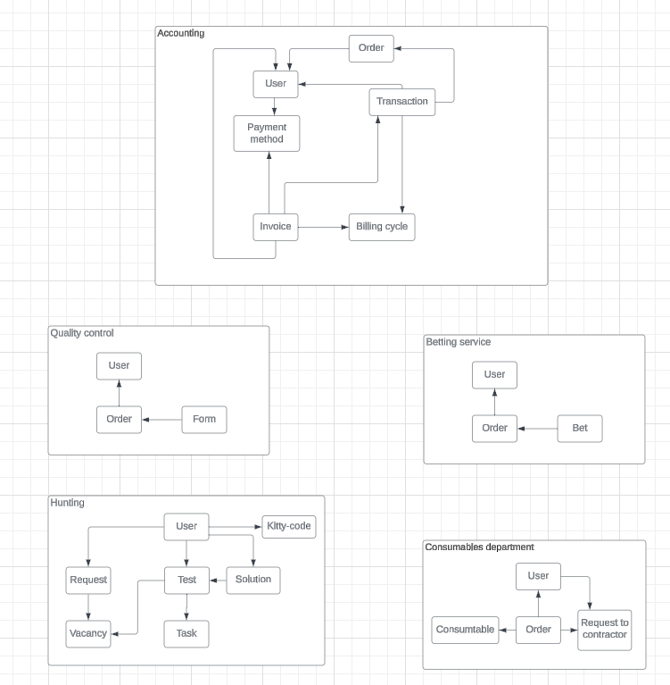
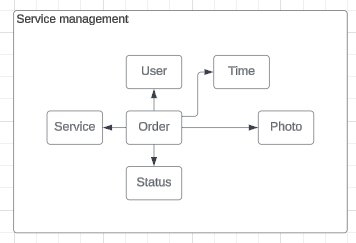
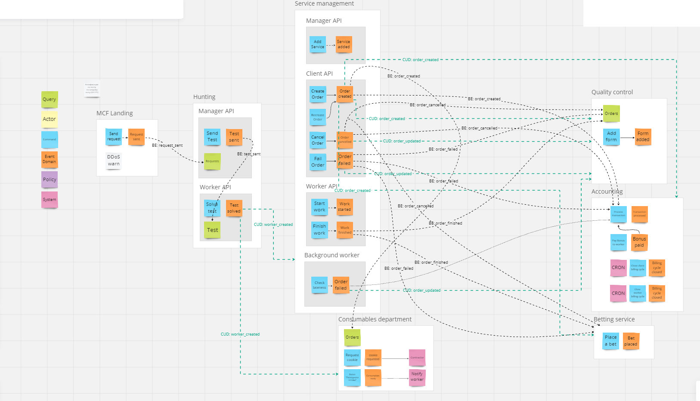

## Схема:
### Event Storming

В процессе переработки требований в ES команды и события начали собираться в относительно независимые друг от друга цепочки. Эти цепочки я обозначил как: найм (hunting), бухгалтерский учет (accounting), управление услугами (service management), контроль качества (quality control) и тотализатор (betting service). Такое разделение также отражает процессы, происходящие в фирме.

### Модель данных

### Сервисы
