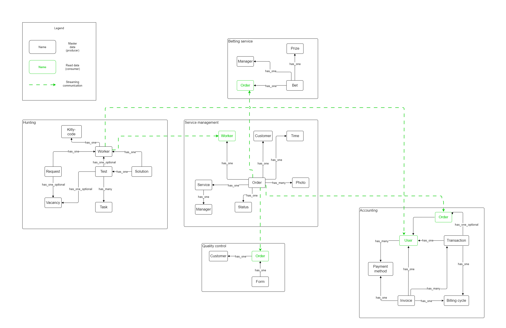
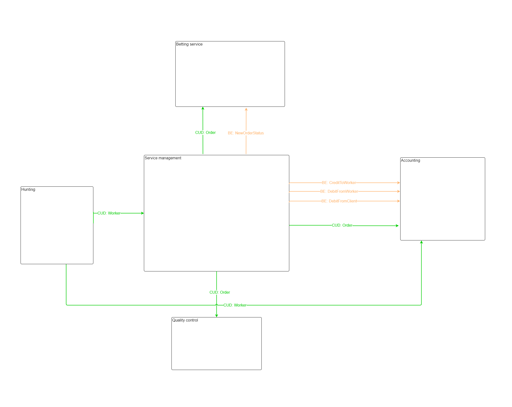

## Схема v1.0.0
### Event Storming

В процессе переработки требований в ES команды и события начали собираться в относительно независимые друг от друга цепочки. Эти цепочки я обозначил как: найм (hunting), бухгалтерский учет (accounting), управление услугами (service management), контроль качества (quality control) и тотализатор (betting service). Такое разделение также отражает процессы, происходящие в фирме.

***

### Модель данных

***

### Коммуникации 

***

### Выбор структуры проекта 

TTM (Time To Market):

Микросервисы, так как между контекстами мало связей, и потенциально изменения одного сервиса маловероятно приведут к изменениям другого. Кроме того, неизвестно, кто придет разработчиками. Проще будет контролировать отдельные сервисы.

Перформанс:

Микросервисы, так как между контекстами мало связей и запросы к БД будут быстрыми. Кроме того, это будет задел на будущее расширение системы.

Стоимость:

Микросервисы, так как бюджет безлимитный.

Как элементы будут общаться между собой:

Микросервисы. Можно реализовать как синхронные, так и асинхронные коммуникации, в случае необходимости (бюджет безлимитный).

Таким образом, мы останавливаем свой выбор на микросервисах.