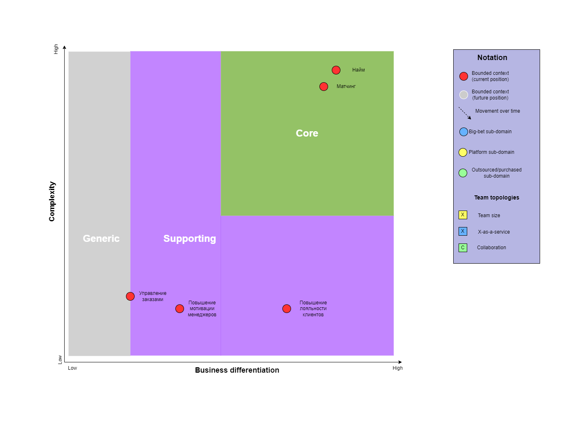
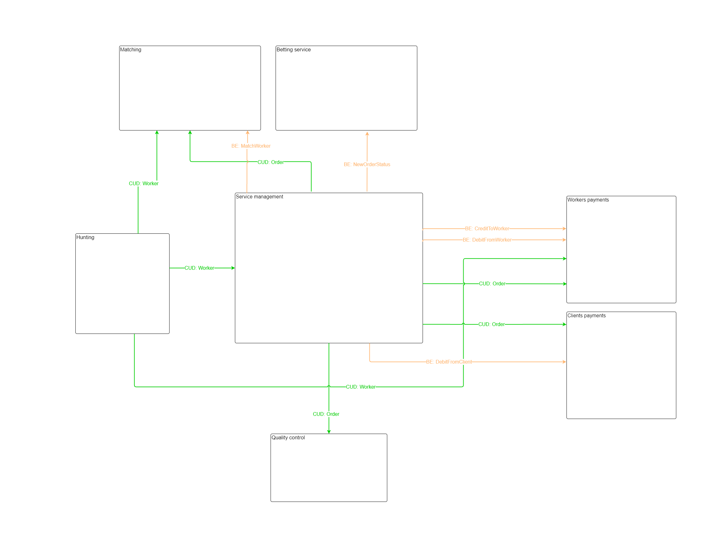

Схема v2.0.0
======

Поддомены
------
| Поддомен | Обоснование |
|------------|------------|
| Управление заказами | Все что имеет отношение непосредственно к заказу. Оформление, обработка заказа. Выставление счетов и обработка платежей. |
| Найм | Добыча качественной рабочей силы. Конкурентное преимущество бизнеса. |
| Матчинг | Подбор воркера под заказ. Конкурентное преимущество бизнеса. |
| Повышение лояльности клиентов | Данную проблему решает контроль качества. |
| Повышение мотивации менеджеров | Данную проблему решает тотализатор. |

Типы поддоменов
------

| Вид поддомена | Конкурентное преимущество | Сложность доменной модели | Изменчивость | Варианты реализации | Интерес проблемы | Предполагаемый вид поддомена |
|------------|------------|------------|------------|------------|------------|------------|
| Управление заказами | нет | низкий | низкая | ??? | низкий  | generic / supporting |
| Найм | да | высокая | частая | ??? | высокий  | core |
| Матчинг | да | высокая | частая | ??? | высокий  | core |
| Повышение лояльности клиентов | нет | низкая | редкая | ??? | средний  | supporting |
| Повышение мотивации менеджеров | нет | низкая | редкая | ??? | низкий  | supporting |

Core domain chart
------

Боундед-контексты
------

Сравнение боундед-контекстов с прошлой версией
------

### Отличие 1
В первой версии был добавлен контекст бухгалтерии, несмотря на отсутствие требований. Все что нам нужно - выполнять платежи и списания. Этот функционал - часть флоу заказа. Контекст поделился на два боундед-контекста: для списания и начисления. 

### Отличие 2
В отдельный поддомен выделил матчинг, т.к. это конкурентное преимущество бизнеса, отдельная проблема. 

Event Storming
------

Характеристики
------

| Характеристики | Источник |
|------------|------------|
| scalability, securability | [US-081] Мы ожидаем 1к заявок в день от рандомных котов, также, судя по отзывам, наши конкуренты могут попытаться нас заддосить в этом месте. Они так делали уже несколько раз с другими компаниями, после чего компании закрывались с позором. |
| agility, testability, deployability | Низкий ТТМ |
| modifiability, testability, deployability | Для бизнеса критично проверять новые гипотезы по отсеву котов и изменять уже существующие с максимальной скоростью и надёжностью.|
| agility, testability, deployability, scalability, availability, fault tolerance | Конкурентное преимущество (найм + матчинг) |
| availability, continuity, reliability, еxtensibility, modifiability, maintainability, supportability, readability, accessibility, security, usability | 2 core-поддомена (найм + матчинг) являются конкурентным преимуществом |
| maintainability, readability, supportability | 3 supporting-поддомена |

Выбор архитектурного стиля
------
Выделим наиболее важные для проекта характеристики и обозначим их на таблице архитектурных стилей. Наилучшим образом нашим требованиям удовлетворяет микросервисная архитектура.
***

Модель данных
------

Коммуникации 
------

