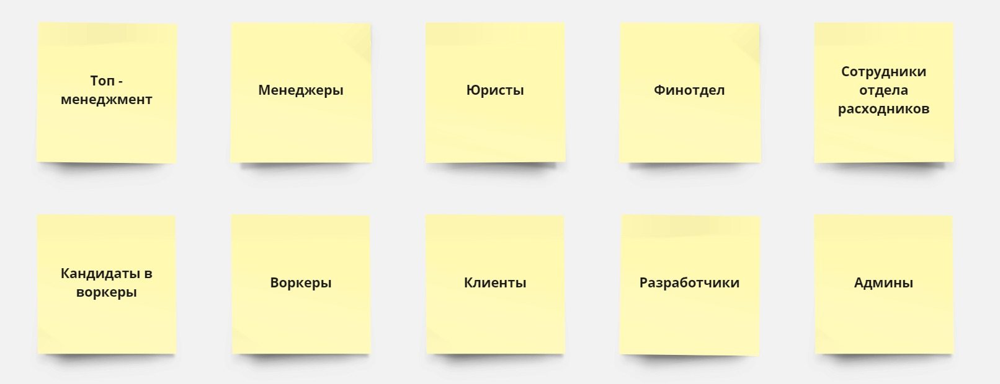
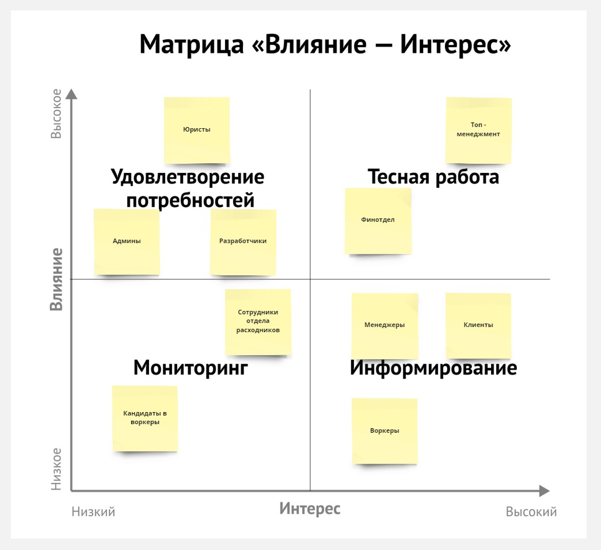
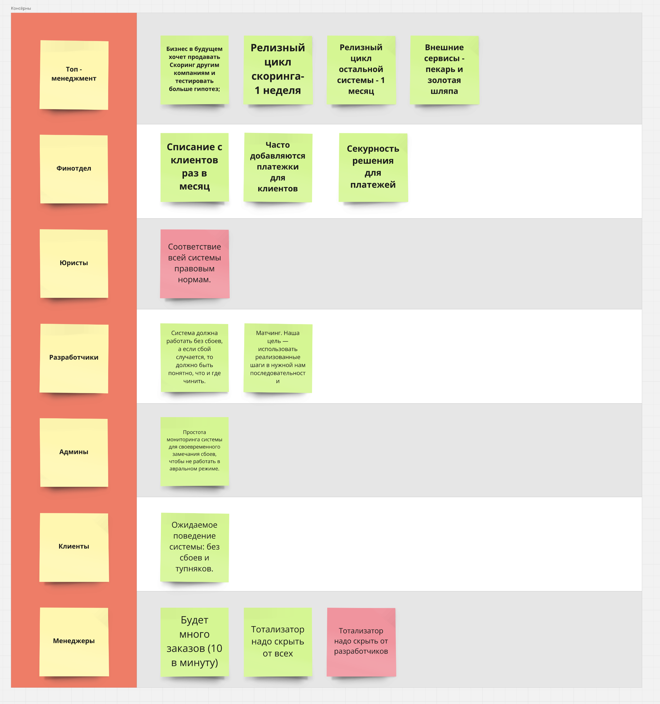
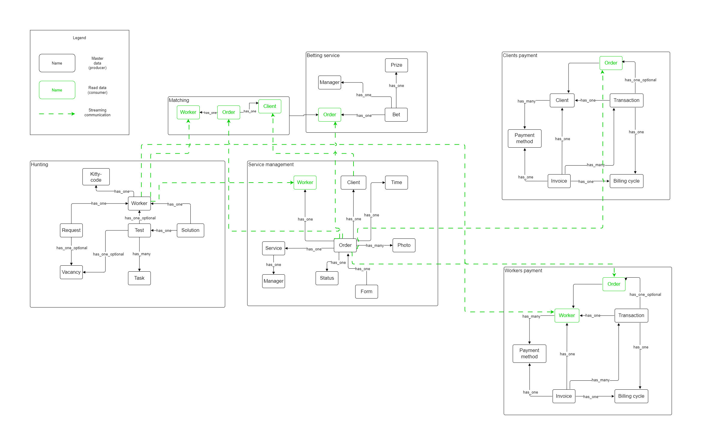
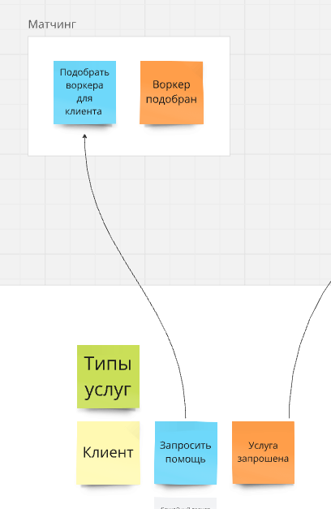
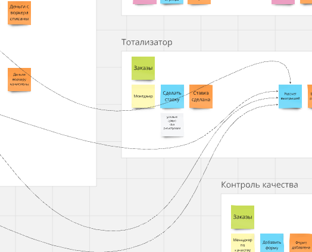

Схема v3.0.0
======

Стейкхолдеры
------

Матрица влияние-интерес
------

Консёрны
------

Ограничения
------

- инфраструктуру считаем бесплатной
- соблюдение CatFinComplience, который говорит об особом способе хранения данных и особой наблюдаемости за системой. Компания не хочет повторять опыт с маски-шоу, которые были в Happy Cat Box.

Характеристики
------

| Характеристики | Источник |
|------------|------------|
| scalebility, securebility | [US-081] Мы ожидаем 1к заявок в день от рандомных котов, также, судя по отзывам, наши конкуренты могут попытаться нас заддосить в этом месте. Они так делали уже несколько раз с другими компаниями, после чего компании закрывались с позором. |
| agility, testability, deployability | Низкий ТТМ |
| modifiability, testability, deployability | Для бизнеса критично проверять новые гипотезы по отсеву котов и изменять уже существующие с максимальной скоростью и надёжностью.|
| agility, testability, deployability, scalability, availability, fault tolerance | Конкурентное преимущество (найм + матчинг) |
| availability, continuity, reliability, еxtensibility, modifiability, maintainability, supportability, readability, accessibility, security, usability | 2 core-поддомена (найм + матчинг) являются конкурентным преимуществом |
| maintainability, readability, supportability | 3 supporting-поддомена |
| maintainability, reliability | Общий консёрн админов и разрабов |
| deployability | Консёрн топ-менеджеров |
| Consistency | Хранение данных о фин. операциях |

Выбор архитектуры
------

agility, deployability и testability исключают монолит. Определим, из каких сервисов будет состоять система.

### Выплаты воркерам

Есть ограничение на соблюдение CatFinComplience. Придется делать отдельным сервисом.

### Оплата заказов

Есть ограничение на соблюдение CatFinComplience. Логика хотя и выглядит сходно с сервисом выплат воркерам, процесс другой и не стоит сливать с ним. Придется делать отдельным сервисом.

### Найм воркеров

Релизный цикл, согласно требованию топ-менеджеров - 1 неделя, против месячного цикла у других конекстов. Придется вынести в отдельный сервис.

### Тотализатор

Тотализатор должен быть максимально скрыт, значит отдельынй сервис.

### Матчинг воркеров

Core - поддомен. Должны быть availability, continuity, reliability, еxtensibility, modifiability, maintainability, supportability, readability, accessibility, security, usability, чего нет в оставшихся поддоменах.

Конкурентное преимущество. Следовательно, вероятнее всего, будет собственный релизный цикл, несмотря на то, что сейчас он общий для всех, кроме найма.
Выносим в отдельный сервис.

### Управление заказами и контроль качества

Можно объединить с оставшимся контекстом "контроль качества", но:
- Это другой поддомен
- Разный Scalability

Поэтому выносим в отдельные сервисы.

Выбор стилей сервисов
------

### Матчинг воркеров

Разработчики пишут: [US-300] Алгоритм матчинга — общий для любых образцов, состоит из набора шагов, по которым рассчитываются рейтинги и другие значения. Система чем-то похожа на map-reduce. Разработчики решили, что они сами будут реализовывать всю логику на любом языке, так как они не хотят делиться алгоритмом. Наша цель — использовать реализованные шаги в нужной нам последовательности, которая иногда может изменяться, при этом необходимо иметь возможность добавлять или редактировать шаги, как нам это необходимо.

Наиболее подходящий стиль в данном случае - Pipeline.

### Найм воркеров

Могут быть очень разные тесты. Удобно будет реализовать как Microkernel.

### Управление заказами

Модульный монолит для реализации разных эндпойнтов под оформление заказа, сборку и т.д.

### Выплаты воркерам, оплата заказов, контроль качества, тотализатор

Под эти сервисы сгодится layered монолит.

Выбор вида базы данных
------

### Выплаты воркерам, оплата заказов

Необходимо соблюдать комплаенс, поэтому базы должны быть отдельными. Из-за требований к consistency нужны изолированные реляционные базы.

### Матчинг

Графовые бд отлично подходят под всякий датасайнс: задачи матчинга и т.п. 

### Найм воркеров

Возможна повышенная нагрузка из-за DDoS. Лучше выделить как отдельную реляционную БД.

### Управление заказами, контроль качества 

Можно использовать общую реляционную БД. Позволит делать меньше http-запросов и т.д.

### Тотализатор

Требование его спрятать - делаем отдельную реляционную БД.

Выбор вида коммуникаций
------

### Event Storming

### Data Model

### Бизнесовые коммуникации

#### Запрос матчинга воркера.  

Тут не обязательно делать синхронный запрос на матчинг. Можно отправить событие и дать сервису его обдумать. Асинхронный event-driven. Нужно учесть, что данных в сервисе матчинга может временно не быть.

#### Рассчитать приз.  

Тут также ждать не обязательно. Асинхронный event-driven.

### CUD коммуникации

Везде можно использовать асинхронные event-driven. 

