Исправление системы
======

Схема исходной реализации
------
### Сервисы
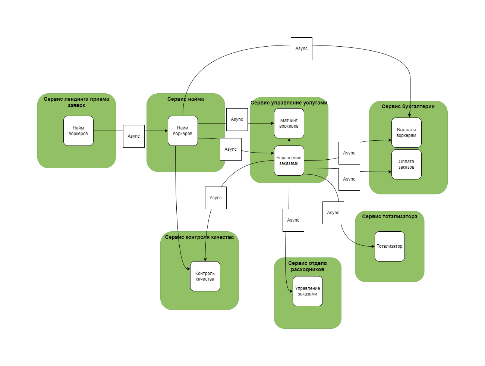

Схема целевой реализации
------

### Сервисы
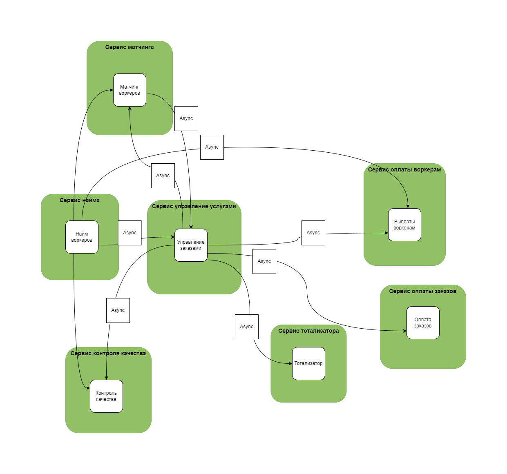

Необходимые изменения
------

### Сервисы, которые следует удалить
 - Лендинг приема заявок
 - Сервис отдела расходников
 - Сервис бухгалтерии

### Сервисы, которые следует добавить
- Сервис матчинга
- Сервис оплаты воркерам
- Сервис оплаты заказов

### Рассчет instability

Instability = Ce / (Ca + Ce)

#### Лендинг приема заявок

Instability = 1 / 1 = 1

#### Сервис отдела расходников

Instability = 0 / 1 = 0

#### Сервис бухгалтерии

Instability = 0 / 3 = 0

#### Сервис матчинга

Instability = 1 / (2 + 1) = 1/3

#### Сервис оплаты воркерам

Instability = 0 / 2 = 0

#### Сервис оплаты заказов

Instability = 0 / 1 = 0

### Изменения сервисов

#### Лендинг приема заявок

Сервис реализует общий боундед-контекст найма и должен быть слит с сервисом найма.

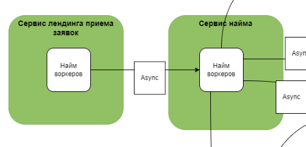

#### Сервис отдела расходников

Сервис реализует общий боундед-контекст управления услугами. Нужно добавить API получения информации об услугах. Данные переносить не нужно, база будет общей.

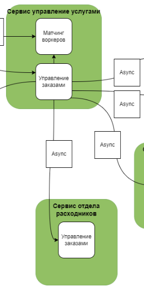

#### Сервис бухгалтерии

Сервис реализует два боундед-контекста: "оплата воркерам" и "оплата заказов". Нужно сделать по одному сервису на боундед-контекст и разделить базы, чтобы избежать проблем в дальнейшем, если будут как-то меняться данные.

#### Сервис матчинга

Необходимо выделить из из сервиса управления услугами функционал, относящийся к домену и контексту "матчинг" и вынести его в отдельный сервис. 

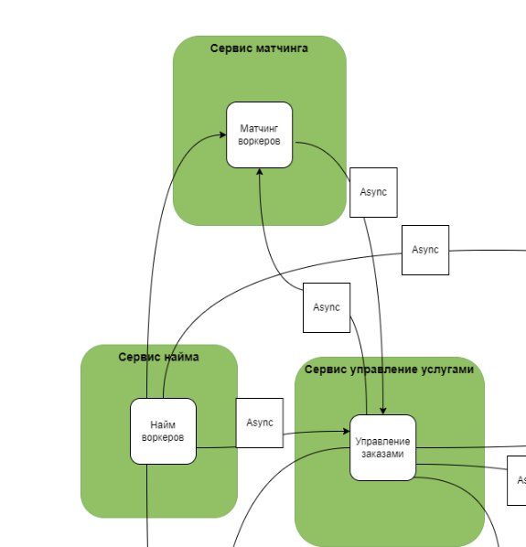

#### Сервис оплаты воркерам и Сервис оплаты заказов

 Нужно сделать по одному сервису на боундед-контекст и разделить базы, чтобы избежать проблем в дальнейшем, если будут как-то меняться данные.

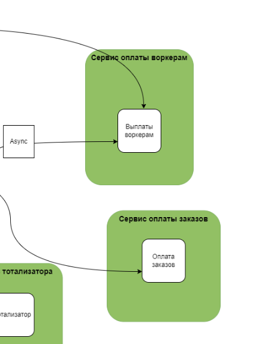

План работ когда свободных людей и ресурсов нет, а опыт и (или) инфраструктура есть
------

Т.к. опыт есть, а ресурсов нет, первым делом следует брать самые важные с точки зрения бизнеса сервисы - матчинг и Лендинг приема заявок (core-поддомены). Далее можно взять в работу бухгалтерию и сервис отдела расходников (supporting-поддомены):

1) матчинг
2) Лендинг приема заявок
3) бухгалтерия
4) сервис отдела расходников

## Матчинг
Т.к. в новом сервисе требуется использовать новый вид БД (Графовый), тогда мы выбираем паттерна для распиливания Change Data Capture. То есть, наполняем новую базу и переносим логику.

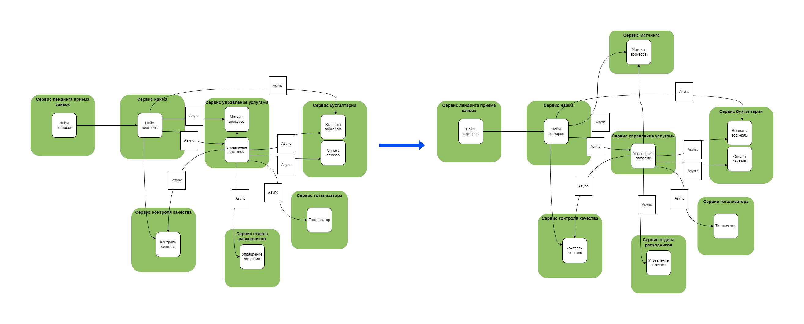

## Лендинг приема заявок
Сервис был лендингом, без БД, который слал через себя евенты в сервис найма, то нужно просто интегрировать форму приема заявок в сервис найма и обеспечить защиту от DDoS.

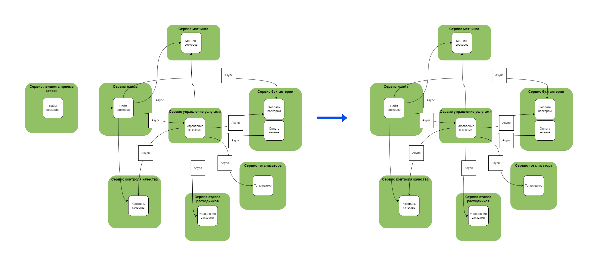

## Бухгалтерия
Распиливаем сервис бухгалтерии. Не требуется менять модели данных, или пилить новый функционал. Можно использовать Tactical Forking. Прикручиваем два форка, делим трафик по новым сервисам и грохаем лишнюю логику.

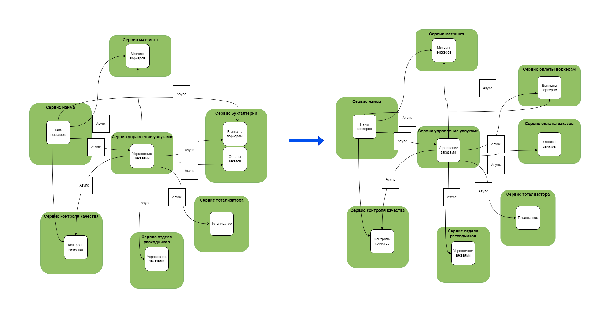

## Сервис отдела расходников
Тут нужно только докинуть API в сервис управления услугами и можно удалить Сервис отдела расходников. База будет общая.

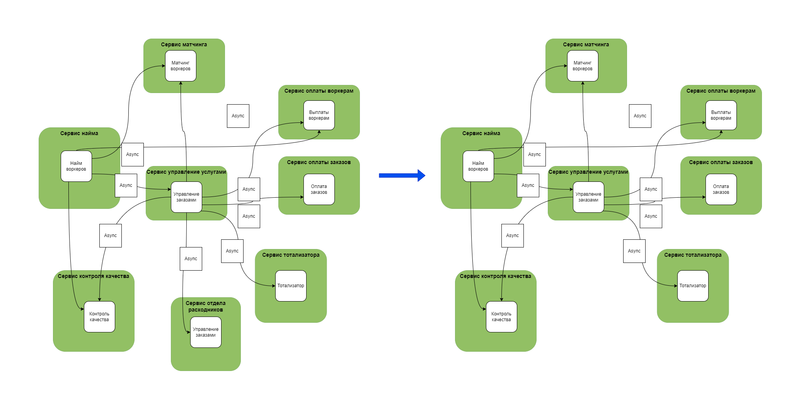

План работ когда есть свободные люди и ресурсы, а опыта и (или) инфраструктуры нет
------

Т.к. люди и ресурсы есть а опыта нет, первым делом надо набраться опыта распила и брать наименее критичные с точки зрения бизнеса сервисы - сервис отдела расходников и бухгалтерия (supporting-поддомены). Далее можно взять в работу Лендинг приема заявок и матчинг (core-поддомены):

1) сервис отдела расходников
2) бухгалтерия
3) Лендинг приема заявок
4) матчинг

## Сервис отдела расходников
Тут нужно только докинуть API в сервис управления услугами и можно удалить Сервис отдела расходников. База будет общая.

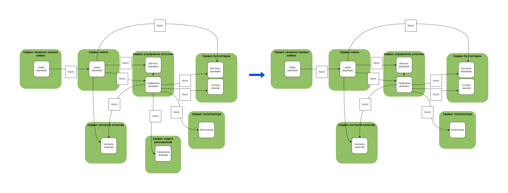

## Бухгалтерия
Распиливаем сервис бухгалтерии. Не требуется менять модели данных, или пилить новый функционал. Можно использовать Tactical Forking. Прикручиваем два форка, делим трафик по новым сервисам и грохаем лишнюю логику.

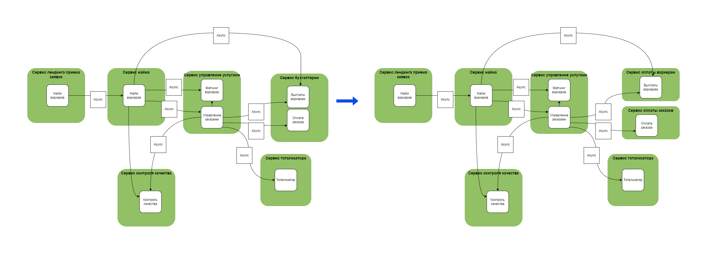

## Лендинг приема заявок
Сервис был лендингом, без БД, который слал через себя евенты в сервис найма, то нужно просто интегрировать форму приема заявок в сервис найма и обеспечить защиту от DDoS.

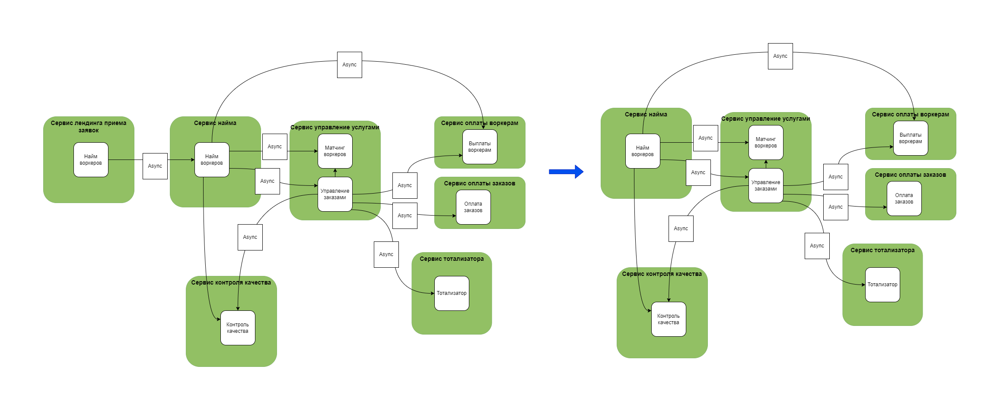
## Матчинг
Т.к. в новом сервисе требуется использовать новый вид БД (Графовый), тогда мы выбираем паттерна для распиливания Change Data Capture. То есть, наполняем новую базу и переносим логику.

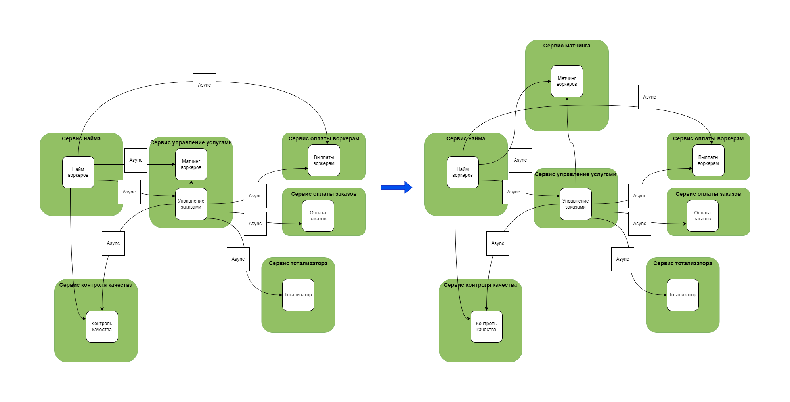