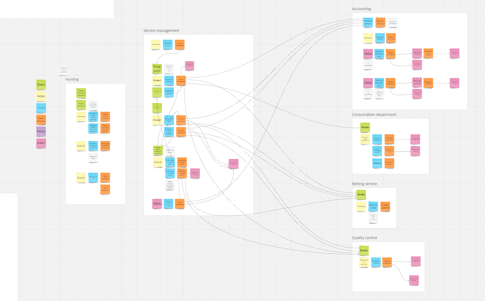
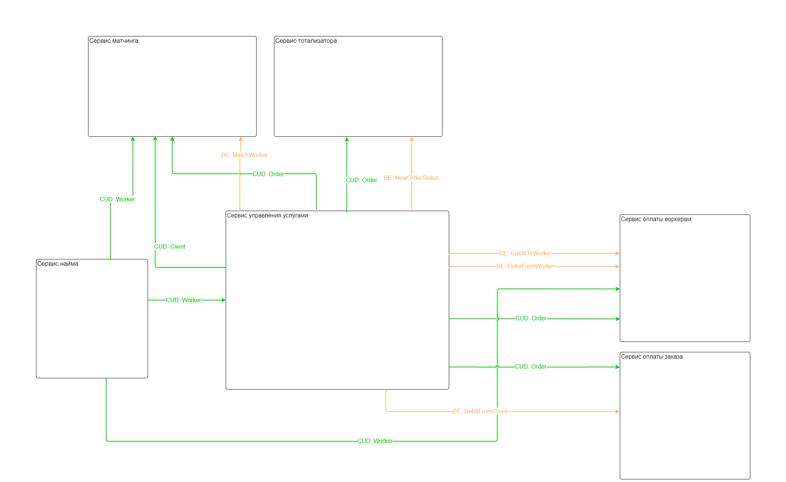

Исправление системы
======

Схема исходной реализации
------
### Event Storming

### Модель данных

### Сервисы

Схема целевой реализации
------

### Характеристики

### Event Storming

### Модель данных

### Сервисы
